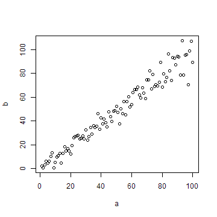

# Class 3 #

---

# Review #

---
* Preparing data in csv format (excel)
* Importing data set from csv.
* Calling variables
* Using **attach()** function
* Telling apart **numeric variables** and **factor variable**
* Using **str()** function
* Using **mean(), median(), sd(), range(), min(), max()** functions
* Storing result in a new variable
* Using **summary()** function
* Getting subset of the data: **subset()** function

---

# 1. More on factors #

---
### Converting to and from factor ###

* Whis is the distinction between numeric and factor variable important?

<pre class="knitr">
cscore &lt;- read.csv("Class.score.csv")
par(mfrow=c(1,2))
plot(cscore$class, cscore$score)
plot(as.factor(cscore$class), cscore$score)

</pre>

---
<pre class="knitr">
round(coef(summary(lm(score~class, data=cscore))), 3)

##             Estimate Std. Error t value Pr(>|t|)
## (Intercept)   74.613      3.125   23.88    0.000
## class         -0.015      0.504   -0.03    0.976

round(coef(summary(lm(score~as.factor(class), data=cscore))), 3)

##                    Estimate Std. Error t value Pr(>|t|)
## (Intercept)            70.4      4.447  15.830    0.000
## as.factor(class)2      -1.4      6.290  -0.223    0.824
## as.factor(class)3       9.8      6.290   1.558    0.123
## as.factor(class)4      10.2      6.290   1.622    0.108
## as.factor(class)5      11.9      6.290   1.892    0.062
## as.factor(class)6      -4.0      6.290  -0.636    0.526
## as.factor(class)7       7.1      6.290   1.129    0.262
## as.factor(class)8      -0.2      6.290  -0.032    0.975
## as.factor(class)9       4.1      6.290   0.652    0.516
## as.factor(class)10      3.8      6.290   0.604    0.547

</pre>

---
* How can we make factors?

<pre class="knitr">
# We have this character variable names 'ses'
ses &lt;- c("low", "middle", "low", "low", "low", "low", "middle", "low", "middle", "middle", "middle", "middle", "middle", "high", "high", "low", "middle", "middle", "low", "high")

ses.factor&lt;-factor(ses)
ses.factor

##  [1] low    middle low    low    low    low    middle low    middle middle
## [11] middle middle middle high   high   low    middle middle low    high  
## Levels: high low middle

</pre>

---
* Why is the factor level "high, low, middle" not "low, middle, high"?

<pre class="knitr">
# ordered factor
ses.ordered&lt;-ordered(ses, levels=c('low', 'middle', 'high'))
ses.ordered

##  [1] low    middle low    low    low    low    middle low    middle middle
## [11] middle middle middle high   high   low    middle middle low    high  
## Levels: low < middle < high

cscore$class&lt;-ordered(cscore$class, levels=1:10)
cscore$class

##   [1] 1  2  3  4  5  6  7  8  9  10 1  2  3  4  5  6  7  8  9  10 1  2  3 
##  [24] 4  5  6  7  8  9  10 1  2  3  4  5  6  7  8  9  10 1  2  3  4  5  6 
##  [47] 7  8  9  10 1  2  3  4  5  6  7  8  9  10 1  2  3  4  5  6  7  8  9 
##  [70] 10 1  2  3  4  5  6  7  8  9  10 1  2  3  4  5  6  7  8  9  10 1  2 
##  [93] 3  4  5  6  7  8  9  10
## Levels: 1 < 2 < 3 < 4 < 5 < 6 < 7 < 8 < 9 < 10

</pre>

---
* How can we treat a factor variable as a numeric variable?

<pre class="knitr">
as.numeric(cscore$class)

##   [1]  1  2  3  4  5  6  7  8  9 10  1  2  3  4  5  6  7  8  9 10  1  2  3
##  [24]  4  5  6  7  8  9 10  1  2  3  4  5  6  7  8  9 10  1  2  3  4  5  6
##  [47]  7  8  9 10  1  2  3  4  5  6  7  8  9 10  1  2  3  4  5  6  7  8  9
##  [70] 10  1  2  3  4  5  6  7  8  9 10  1  2  3  4  5  6  7  8  9 10  1  2
##  [93]  3  4  5  6  7  8  9 10

</pre>

---

# 2. Correlation #

---
* What is correlation?
: How much of the total variation is explained by co-variation?

<pre class="knitr">
a&lt;-1:100
b&lt;-a+rnorm(100, 0, sqrt(a))
sample&lt;-data.frame(a,b)
plot(sample)

</pre>

---
<pre class="knitr">
c&lt;-cov(sample)
c[1,2]/(sqrt(c[1,1])*sqrt(c[2,2]))

## [1] 0.9765

cor(sample)

##        a      b
## a 1.0000 0.9765
## b 0.9765 1.0000

</pre>

---

* Correlation among multiple variables

<pre class="knitr">
require(ISwR)
data(cystfibr)
require(ellipse)
plotcorr(cor(cystfibr))

</pre>

---
<pre class="knitr">
pairs(cystfibr, lower.panel=panel.smooth, upper.panel=panel.cor)

</pre>

---

# 3. Simple Linear Regression #

---
* Independent variable & Dependent variable
* Explanatory variable or Predictor variable

* How can we **explain** or **predict** dependent variables from **independent variables**?
---
* **Formula notation**
  * independent variable ~ dependent variable(1) + dependent variable(2)....
---
<pre class="knitr">
plot(sample)

</pre>

---
<pre class="knitr">
model&lt;-lm(b~a, data=sample)
round(coef(summary(model)), 3)

##             Estimate Std. Error t value Pr(>|t|)
## (Intercept)    0.623      1.291   0.482    0.631
## a              0.996      0.022  44.882    0.000

plot(density(b-mean(b)), ylim=c(0,0.07), main='Density of b and residuals')
lines(density(resid(model)), col='red')
text(50, 0.04, paste('var=', round(var(b-mean(b)),0)))
text(50, 0.035, paste('var=', round(var(resid(model)),0)), col='red')

</pre>

